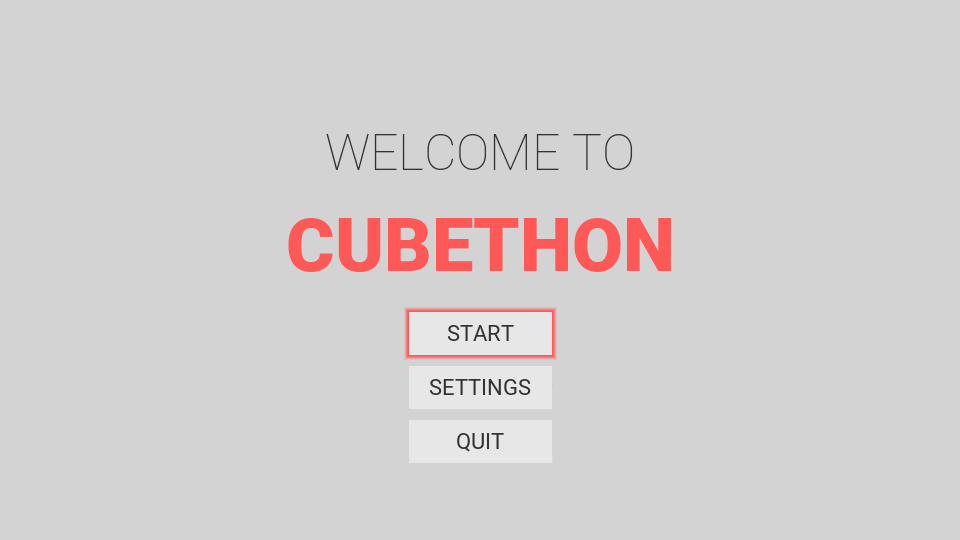

# CUBETHON (cube-game)
### CUBETHON conversion from Unity to Godot 3.1.1

Game was originally maded by [BRACKEYS](https://www.youtube.com/user/Brackeys), so he is an author. I just made a conversion to Godot Engine and made some enhancements.
* [Original game here](http://devassets.com/assets/how-to-make-a-video-game/)
* [Original game tutorial series](https://www.youtube.com/playlist?list=PLPV2KyIb3jR53Jce9hP7G5xC4O9AgnOuL)
## Gameplay
**Avoid obstacles and complete the level without falling out from road.** Simple!

## Controls (key mapping)
### Menu:
- **Enter/Numpad Enter/Space** - Menu Select
- **Up** - Menu Up
- **Down** - Menu Down

### Gameplay:
- **A/Left** - Slide to the left
- **D/Right** - Slide to the right
- **Pause** - Pauses/unpauses game
- **ESC** - Double press to exit to main menu