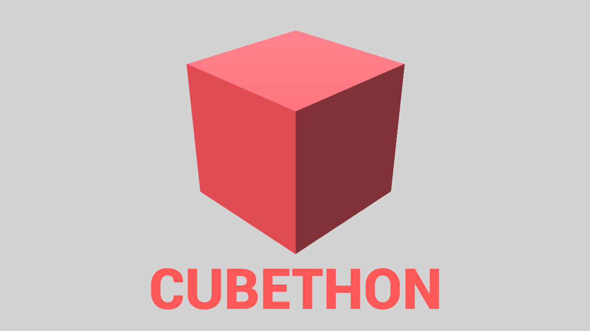

# CUBETHON (cube-game)
### CUBETHON conversion from Unity to Godot 3.1.1

Game was originally maded by [BRACKEYS](https://www.youtube.com/user/Brackeys), so he is an author. I just made a conversion to Godot Engine.
* [**Web version here**](https://darkpro1337.github.io/Cube-Game/) (very unstable)
* [Original game here](http://devassets.com/assets/how-to-make-a-video-game/)
* [Original game tutorial series](https://www.youtube.com/playlist?list=PLPV2KyIb3jR53Jce9hP7G5xC4O9AgnOuL)
